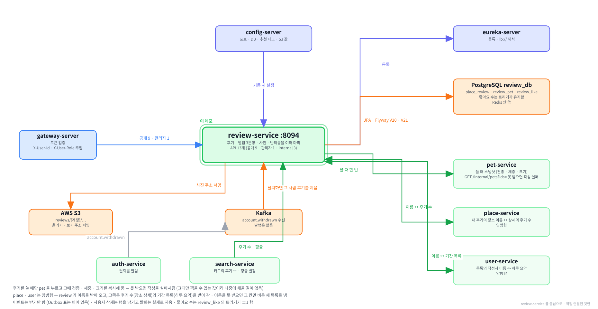

# review-service

반려동물과 다녀온 장소에 후기를 남기는 서비스입니다. 별점 3문항과 사진, 그리고 그날 함께 간 반려동물을 함께 기록합니다.

### 전체 구조 (층)


### 전체 구조 (호출 관계)


### 이 저장소를 중심으로 본 그림



<br><br>

---

## 본문 시작

<br><br>

---

## 먼저 알아 두면 좋은 것

이 저장소를 처음 여는 분을 위해 세 가지만 먼저 적습니다. 나머지 공통 용어는 [service-template 의 용어 장](https://github.com/paw-trail/service-template#11-용어)에 있습니다.

---

**게이트웨이가 넣어 주는 헤더 두 개가 있습니다.**

이 서비스는 로그인을 직접 처리하지 않습니다. 사용자가 누구인지는 게이트웨이가 토큰을 풀어서 헤더에 적어 보내 줍니다.

```
X-User-Id     로그인한 계정의 uuid
X-User-Role   USER 또는 ADMIN
```

그래서 `curl` 로 이 서비스의 포트(8094)를 직접 찌르면 헤더가 없어 401 이 납니다. 확인은 게이트웨이(8080)를 거쳐서 합니다. 직접 부를 일이 있으면 헤더를 손으로 붙여야 합니다.

---

**"스냅샷" 이라는 말이 자주 나옵니다.**

후기는 *그날 그 아이로 다녀온 기록* 입니다. 반려동물의 체중이나 크기는 시간이 지나면 바뀌는데, 후기를 볼 때마다 지금 값으로 다시 그리면 글의 뜻이 달라집니다. 3킬로그램짜리 강아지와 다녀왔다고 쓴 후기가 몇 달 뒤에 8킬로그램으로 보이는 식입니다.

그래서 후기를 쓸 때 pet-service 에서 받아 온 값을 review 쪽 표에 복사해 둡니다. 이렇게 복사해 둔 값을 이 문서에서 스냅샷이라고 부릅니다. 자세한 것은 [2. 반려동물 스냅샷과 여러 마리](#2-반려동물-스냅샷과-여러-마리)에 있습니다.

---

**Inbox 를 씁니다. Outbox 는 쓰지 않습니다.**

이 서비스는 이벤트를 *받기만* 합니다. 계정이 탈퇴하면 auth-service 가 `account.withdrawn` 을 내보내고, 이 서비스가 그것을 받아 후기를 정리합니다. 같은 이벤트가 두 번 와도 한 번만 처리하도록 받은 이벤트의 식별자를 표에 적어 두는데, 그 장치가 Inbox 입니다.

반대로 이 서비스가 먼저 내보내는 이벤트는 없어서 Outbox 표는 만들지만 비어 있습니다. 자세한 것은 [9. 탈퇴 처리](#9-탈퇴-처리)에 있습니다.

<br><br>

---

## 0. 하는 일

### 0-1. 한 문장으로

장소 하나에 달린 후기를 보여 주고, 로그인한 사용자가 자기 반려동물과 다녀온 기록을 남기게 합니다.

실제로 저장되는 후기 한 건은 이런 모습입니다.

```json
{
  "reviewId": "7c2f1a9e-3b40-4d51-9f28-6a1e0c5d8b33",
  "placeId": "0f3b6d21-88c4-4e07-a5f9-2d1b7c904e6a",
  "visitedAt": "2026-09-14",
  "rating": 5,
  "facilityScore": 5,
  "ruleScore": 4,
  "moodScore": 5,
  "content": "물그릇을 따로 내주셔서 편했어요. 야외석이 넓어 두 마리 데려가도 좁지 않았습니다.",
  "photos": ["reviews/7c2f1a9e/1.jpg"],
  "tags": ["음수대 제공완료", "야외석 넓음"],
  "likeCount": 3,
  "pets": [
    { "petId": "a1…", "breedName": "골든리트리버", "weightKg": 28.5, "breedSize": "LARGE" },
    { "petId": "b2…", "breedName": "말티즈",       "weightKg": 3.2,  "breedSize": "SMALL" }
  ]
}
```

별점이 넷인 것이 눈에 띌 텐데, `rating` 이 전체 별점이고 나머지 셋(`facilityScore` · `ruleScore` · `moodScore`)이 문항별 별점입니다. 시설이 어땠는지, 동반 규칙이 까다롭지 않았는지, 분위기가 어땠는지를 따로 받습니다.

### 0-2. 누구와 주고받는가

```
  프론트 ─→ 게이트웨이 ─→ review-service ─→ pet-service     후기를 쓸 때 (내 아이가 맞는지 · 스냅샷 값)
                             │               place-service   목록에 장소 이름을 붙일 때
                             │               user-service    목록에 작성자 이름을 붙일 때
                             │
                             ├─← user-service       하루 요약을 만들 때 그날 후기를 가져감
                             ├─← search-service     장소 카드의 후기 수 · 평균 별점
                             ├─← place-service      장소 상세의 후기 수 · 평균 별점
                             └─← Kafka              account.withdrawn 을 받아 후기를 정리
```

| 상대 | 방향 | 언제 | 없으면 |
|---|---|---|---|
| pet-service | review 가 부름 | 후기를 쓸 때 | 후기를 쓸 수 없습니다 (스냅샷 값을 못 받으므로) |
| place-service | review 가 부름 | 내 후기 목록에 장소 이름을 붙일 때 | 이름 자리가 `null` 로 나가고 목록은 그대로 나갑니다 |
| user-service | review 가 부름 | 장소 후기 목록에 작성자 이름을 붙일 때 | 이름 자리가 `null` 로 나가고 목록은 그대로 나갑니다 |
| user-service | review 를 부름 | 하루 요약을 만들 때 | user 쪽에서 그날 후기가 빠진 요약이 나옵니다 |
| search-service | review 를 부름 | 검색 색인을 만들 때 | 카드의 후기 수가 옛 값으로 남습니다 |
| place-service | review 를 부름 | 장소 상세를 그릴 때 | 상세의 후기 수가 비거나 옛 값으로 남습니다 |
| auth-service | Kafka 로 받음 | 계정이 탈퇴할 때 | 탈퇴한 사람의 후기가 남습니다 |

세 곳(pet · place · user)을 부를 때는 식별자를 쉼표로 묶어 한 번만 부릅니다. 목록 20건에 대해 20번 부르지 않습니다.

### 0-3. 들어 있는 것과 없는 것

들어 있는 것

- 후기 쓰기 · 고치기 · 지우기, 장소별 후기 목록, 내 후기 목록
- 후기 좋아요
- 사진을 S3 에 올릴 주소 발급
- 고를 수 있는 태그 목록 (config 에서 내려옵니다)
- 관리자 후기 삭제
- 다른 서비스가 쓰는 internal 조회 셋 (후기 수 · 평균 별점 · 기간 목록)

없는 것

- 후기 신고 — report-service 가 받습니다. 신고를 보고 지우는 것은 관리자가 이 서비스의 삭제 API 를 호출해서 합니다
- 알림 — notification-service 가 맡습니다. 좋아요가 달렸다는 알림은 아직 없습니다
- 사진 파일 자체의 보관 — S3 가 맡고 이 서비스는 주소만 내어 줍니다
- 후기를 근거로 한 동반 조건 판단 — policy-service 와 verdict-service 가 맡습니다

### 0-4. 5가지만 기억하면 됩니다

1. 후기 한 건에 반려동물이 1~5마리 들어갑니다. 자식 표 `review_pet` 에 순서대로 담깁니다
2. 반려동물 정보는 쓸 때 복사해 두고 다시 묻지 않습니다 (스냅샷)
3. 후기를 고칠 때 반려동물은 바꿀 수 없습니다. 글·별점·사진·태그만 고칩니다
4. 삭제는 소프트 삭제입니다. 행은 남고 `deleted_at` 이 채워집니다
5. 이벤트는 받기만 합니다 (`account.withdrawn`)

### 0-5. 화면에서 어디에 쓰이는가

| 화면 | 이 서비스가 주는 것 |
|---|---|
| 장소 상세 | 후기 목록 · 후기 수 · 평균 별점 (수와 평균은 place 를 거쳐 옵니다) |
| 후기 쓰기 | 태그 목록 · 사진 업로드 주소 · 후기 저장 |
| 내 후기 | 내가 쓴 후기 목록 (장소 이름 포함) |
| 마이페이지 하루 요약 | user-service 가 이 서비스에서 그날 후기를 받아 씁니다 |
| 검색 결과 카드 | search-service 가 받아 둔 후기 수 · 평균 별점 |
| 관리자 후기 관리 | 신고를 보고 후기를 지우는 자리 |

<br><br>

---

## 1. 로컬에서 띄우기

### 1-1. 흐름

```
① infra 저장소에서 인프라를 올림        Postgres · Kafka · Redis
② config-server 를 올림                 설정을 내려받을 곳
③ eureka-server 를 올림                 서로를 찾는 곳
④ gateway-server 를 올림                8080 입구
⑤ review-service 를 띄움                8094
⑥ 게이트웨이로 후기를 한 건 써 봄
```

②③④ 는 infra 저장소의 `platform` 프로파일에 들어 있어 한 번에 올라갑니다.

### 1-2. 필요한 것

| 무엇 | 쓰는 곳 | 없으면 |
|---|---|---|
| PostgreSQL | `review_db` — 후기 · 좋아요 · Inbox | 기동되지 않습니다 |
| Kafka | `account.withdrawn` 을 받음 | 기동은 되고 탈퇴 처리만 안 됩니다 |
| S3 (AWS) | 사진 업로드 주소 발급 | 주소 발급 API 만 실패합니다 |

Redis 는 쓰지 않습니다.

### 1-3. 함께 떠 있어야 편한 서비스

| 서비스 | 없으면 |
|---|---|
| pet-service | 후기를 쓸 수 없습니다 |
| place-service | 내 후기 목록의 장소 이름이 `null` 입니다 |
| user-service | 장소 후기 목록의 작성자 이름이 `null` 입니다 |

후기를 한 건이라도 써 보려면 pet-service 는 반드시 함께 떠 있어야 합니다.

### 1-4. 이미지로 띄우기

infra 저장소에서 `app` 프로파일에 들어 있습니다.

```powershell
# Windows (PowerShell)
cd C:\Tour_Prj\infra
docker compose --profile infra --profile platform --profile db --profile app up -d review-service
```

```bash
# macOS
cd ~/Tour_Prj/infra
docker compose --profile infra --profile platform --profile db --profile app up -d review-service
```

### 1-5. 소스로 띄우기

IntelliJ 에서 `ReviewApplication` 을 실행합니다. 프로파일을 지정하지 않으면 `local` 로 돕니다.

```powershell
# Windows (PowerShell)
cd C:\Tour_Prj\review-service
.\gradlew clean build
```

```bash
# macOS
cd ~/Tour_Prj/review-service
./gradlew clean build
```

### 1-6. 떴는지 확인

```powershell
# Windows (PowerShell)
docker inspect pawtrail-review-service --format "{{.State.Health.Status}}"
curl.exe -s http://localhost:8094/actuator/health
```

```bash
# macOS
docker inspect pawtrail-review-service --format "{{.State.Health.Status}}"
curl -s http://localhost:8094/actuator/health
```

`healthy` 가 뜬 뒤에도 유레카 목록에는 잠시 보이지 않을 수 있습니다. 유레카의 조회 응답이 30초마다 갱신되기 때문이며, 30초쯤 뒤에 다시 보면 `UP` 으로 나옵니다.

### 1-7. 첫 후기 써 보기

게이트웨이를 거쳐서 합니다. 테스트 계정은 `pawtrail.noreply+u1@gmail.com` / `test1234` 입니다.

```powershell
# Windows (PowerShell)
$gw = "http://localhost:8080"

# 로그인 — 쿠키를 세션에 받아 둡니다
$login = @{ email = "pawtrail.noreply+u1@gmail.com"; password = "test1234" } | ConvertTo-Json
Invoke-WebRequest -Uri "$gw/api/v1/auth/login" -Method Post -Body $login -ContentType "application/json" -SessionVariable sess

# 고를 수 있는 태그 목록
Invoke-WebRequest -Uri "$gw/api/v1/reviews/tags" -WebSession $sess | Select-Object -ExpandProperty Content
```

```bash
# macOS
gw="http://localhost:8080"

curl -s -c /tmp/pawtrail.cookie -X POST "$gw/api/v1/auth/login" \
  -H "Content-Type: application/json" \
  -d '{"email":"pawtrail.noreply+u1@gmail.com","password":"test1234"}'

curl -s -b /tmp/pawtrail.cookie "$gw/api/v1/reviews/tags"
```

여기까지 태그 다섯 개가 내려오면 게이트웨이 · 설정 서버 · 이 서비스가 모두 맞물린 것입니다. 실제로 후기를 쓰는 요청은 반려동물 식별자가 필요하므로 [3. 후기 쓰는 차례](#3-후기-쓰는-차례)에서 이어서 다룹니다.
<br><br>

---

## 2. 반려동물 스냅샷과 여러 마리

이 저장소에서 가장 많이 묻는 자리입니다. 왜 반려동물을 따로 표에 담는지, 왜 나중에 바꿀 수 없는지를 다룹니다.

### 2-1. 후기 한 건에 1~5마리

후기를 쓸 때 함께 다녀온 아이를 여러 마리 고를 수 있습니다.

| 값 | 규칙 |
|---|---|
| 최소 | 1마리 — 아무도 고르지 않으면 "누구와 다녀왔는지" 를 잃습니다 |
| 최대 | 5마리 — 사진 상한과 같은 수입니다 |
| 순서 | 보낸 순서가 화면에 나오는 순서입니다 |
| 중복 | 같은 아이를 두 번 보내면 한 번으로 셉니다 |

요청에서는 `petIds` 한 칸으로 받습니다.

```json
{
  "petIds": ["a1b2c3d4-…", "b2c3d4e5-…"],
  "visitedAt": "2026-09-14",
  "rating": 5
}
```

순서가 값으로 남는 이유는 화면 때문입니다. 후기 카드에 배지를 "골든리트리버 · 28.5kg, 말티즈 · 3.2kg" 처럼 이어 붙이다가 자리가 모자라면 뒤를 "외 2마리" 로 줄이는데, 이때 먼저 보이는 아이가 사용자가 먼저 고른 아이여야 합니다. 그래서 순서를 `review_pet.sort_order` 에 0부터 적어 둡니다.

### 2-2. 자식 표에 담는 까닭

반려동물 한 마리는 값 하나가 아니라 칸 넷짜리 행입니다.

```
pet_id      어떤 아이인지
breed_name  그때 견종
weight_kg   그때 체중
breed_size  그때 크기
```

부모 표에 배열 넷을 나란히 두는 방법도 있었지만 쓰지 않았습니다. 배열 넷은 순서가 어긋나도 DB 가 잡아 주지 못합니다. 견종 배열의 두 번째와 체중 배열의 두 번째가 다른 아이를 가리켜도 저장은 그대로 됩니다. 자식 표로 두면 한 행이 한 아이라 그런 어긋남이 생기지 않습니다.

place-service 의 `place_facility`, policy-service 의 `policy_evidence` 와 같은 모양입니다.

### 2-3. 스냅샷 — 그때 값을 복사해 둡니다

후기를 쓸 때 pet-service 에서 아이 정보를 받아 `review_pet` 에 복사합니다. 후기를 읽을 때 pet-service 를 다시 부르지 않습니다.

| 칸 | 어디서 오는가 | 비어도 되는가 |
|---|---|---|
| `breed_name` | pet-service 의 견종 이름 | 됩니다 — 견종을 정하지 않은 아이가 있습니다 |
| `weight_kg` | pet-service 의 체중 | 됩니다 |
| `breed_size` | 견종 마스터의 크기 구분 (`SMALL` · `MEDIUM` · `LARGE`) | 됩니다 |

복사해 두는 까닭은 후기가 *그날의 기록* 이기 때문입니다. 강아지는 자라고 체중은 바뀝니다. 읽을 때마다 지금 값으로 다시 그리면 "3.2kg 말티즈와 다녀왔다" 고 쓴 글이 반년 뒤에 8kg 으로 보입니다. 글은 그대로인데 옆의 숫자만 달라지는 셈입니다.

한 가지 부작용이 있습니다. 사용자가 pet-service 에서 아이 이름이나 견종을 고쳐도 이미 쓴 후기의 배지는 옛 값 그대로입니다. 이것은 버그가 아니라 의도입니다.

### 2-4. 못 받아 오면 작성을 실패시킵니다

pet-service 를 못 부르면 후기 작성이 실패합니다. 목록에서 장소 이름을 못 받아 올 때 `null` 로 두고 그냥 내보내는 것과 다릅니다.

이유는 되돌릴 수 있는지에 있습니다. 목록의 이름은 다음에 부르면 다시 채워지지만, 스냅샷은 *그때* 만 찍을 수 있습니다. 지금 못 찍으면 그 후기는 영영 빈 칸으로 남습니다.

남의 아이가 섞여 있을 때도 마찬가지로 전부 실패시킵니다. 남의 아이만 빼고 나머지를 저장하면 사용자는 고른 대로 저장된 줄 알게 됩니다.

```
PET_NOT_OWNED   403   본인의 반려동물로만 후기를 작성할 수 있습니다.
```

### 2-5. 나중에 바꿀 수 없습니다

후기 수정 요청에는 반려동물 칸이 아예 없습니다. 방문일도 없습니다. 고칠 수 있는 것은 별점 넷 · 내용 · 사진 · 태그뿐입니다.

아이를 뒤늦게 더할 수 있게 하면 그 아이의 스냅샷은 방문 당시가 아니라 오늘 값이 됩니다. 한 후기 안에 9월의 체중과 12월의 체중이 섞여 들어가는 것입니다. 그러면 스냅샷을 두는 의미 자체가 없어집니다.

아이를 잘못 골랐다면 지우고 다시 쓰는 것이 맞습니다.

### 2-6. 지워도 남습니다

후기를 지울 때 `review_pet` 의 행은 그대로 남습니다. 후기 삭제가 소프트 삭제라 부모 행이 남고, 외래키의 연쇄 삭제도 돌지 않기 때문입니다. 신고를 되짚을 때 어떤 아이와 다녀온 후기였는지가 보여야 합니다.

<br><br>

---

## 3. 후기 쓰는 차례

### 3-1. 차례

```
① petIds 를 중복 없이 추립니다
② pet-service 에 한 번에 물어 본인의 아이인지 보고 스냅샷을 받습니다
③ 한 마리라도 본인 것이 아니면 403 으로 끝냅니다
④ 태그를 추천 목록에 있는 것만 남깁니다
⑤ 사진 주소에서 키를 뽑고 본인 자리의 것만 남깁니다
⑥ place_review 에 한 행을 씁니다
⑦ review_pet 에 고른 순서대로 행을 씁니다
⑧ 201 과 reviewId 를 돌려줍니다
```

②는 아이가 몇 마리든 호출 한 번입니다. 식별자를 쉼표로 묶어 보냅니다.

### 3-2. 요청 칸

`POST /api/v1/places/{placeId}/reviews`

| 칸 | 규칙 | 안 지키면 |
|---|---|---|
| `petIds` | 1~5개 · 필수 | 400 |
| `visitedAt` | 오늘까지 · 필수 | 400 |
| `rating` | 1~5 · 필수 | 400 |
| `facilityScore` | 1~5 · 필수 | 400 |
| `ruleScore` | 1~5 · 필수 | 400 |
| `moodScore` | 1~5 · 필수 | 400 |
| `content` | 1~1000자 · 필수 | 400 |
| `photos` | 5장까지 · 없어도 됨 | 400 |
| `tags` | 20개까지 · 없어도 됨 | 400 |

`visitedAt` 이 오늘까지인 것은 다녀온 날이라 미래일 수 없기 때문입니다. 컨테이너가 `TZ=Asia/Seoul` 로 도는 서버 시계의 날짜로 봅니다.

### 3-3. 별점이 넷인 까닭

| 칸 | 묻는 것 |
|---|---|
| `rating` | 전체적으로 어땠는지 |
| `facilityScore` | 시설이 어땠는지 (물그릇 · 방석 · 자리 넓이) |
| `ruleScore` | 동반 규정이 까다롭지 않았는지 |
| `moodScore` | 분위기가 어땠는지 |

넷 다 필수입니다. 평균 별점 표시에는 `rating` 만 씁니다. 나머지 셋은 장소 상세에서 문항별로 보여 주는 값입니다.

### 3-4. 태그는 목록에 있는 것만

태그는 사용자가 직접 적는 값이 아니라 고르는 값입니다. 고를 수 있는 목록은 config 저장소의 `app.review.tags` 에서 내려옵니다.

```
음수대 제공완료 · 반려견 방석 완비 · 반려견 놀이터 추천 · 야외석 넓음 · 주차 편함
```

화면이 이미 이 목록만 보여 주지만, 서버가 받을 때 한 번 더 거릅니다. 목록에 없는 값은 조용히 버립니다. 화면을 거치지 않고 부르는 쪽이 있을 수 있기 때문입니다.

값을 바꾸려면 config 저장소의 `review-service.yml` 을 고치고 이 서비스를 다시 띄웁니다. 적힌 순서가 화면에 나오는 순서입니다.

### 3-5. 사진은 주소로 받습니다

사진 파일 자체는 이 서비스를 지나가지 않습니다. 화면이 S3 에 직접 올리고, 이 서비스에는 그 주소만 보냅니다. 자세한 것은 [4. 사진](#4-사진)에 있습니다.

받을 때 주소에서 키를 뽑아 본인 자리(`reviews/{내 계정}/…`)의 것만 남깁니다. 남의 자리를 가리키는 주소는 버립니다.

### 3-6. 응답

```json
{ "reviewId": "7c2f1a9e-3b40-4d51-9f28-6a1e0c5d8b33" }
```

201 과 식별자만 돌려줍니다. 방금 쓴 후기의 전체 모습은 목록을 다시 부르면 나옵니다.

### 3-7. 에러 코드

| 코드 | 상태 | 언제 |
|---|---|---|
| `PET_NOT_OWNED` | 403 | 고른 아이 중에 본인 것이 아닌 아이가 있을 때 |
| `PET_NOT_FOUND` | 404 | 고른 아이가 없을 때 |
| `REVIEW_NOT_FOUND` | 404 | 고치거나 지우려는 후기가 없을 때 |
| `REVIEW_ACCESS_DENIED` | 403 | 남의 후기를 고치거나 지우려 할 때 |
| `INVALID_REVIEW_SCORE` | 400 | 별점이 1~5 밖일 때 |
| `INVALID_REVIEW_CONTENT` | 400 | 내용이 비었거나 1000자를 넘을 때 |

400 은 대개 요청 검증에서 먼저 걸립니다. 위의 `INVALID_` 둘은 검증을 지나온 값이 도메인에서 다시 걸리는 자리입니다.
<br><br>

---

## 4. 사진

### 4-1. 파일은 이 서비스를 지나가지 않습니다

```
① 화면이 이 서비스에 "올릴 주소를 주세요" 라고 요청합니다
② 이 서비스가 서명된 S3 주소를 발급합니다
③ 화면이 그 주소로 파일을 직접 올립니다          ← 이 서비스를 거치지 않습니다
④ 화면이 후기를 쓸 때 받아 둔 주소를 photos 에 담아 보냅니다
⑤ 이 서비스가 주소에서 키만 뽑아 저장합니다
```

이렇게 두면 큰 파일이 서비스의 메모리와 대역폭을 쓰지 않습니다. pet-service · user-service 의 프로필 사진도 같은 방식입니다.

### 4-2. 주소를 발급받기

`POST /api/v1/reviews/upload-url`

| 칸 | 규칙 |
|---|---|
| `fileName` | 255자까지 |
| `contentType` | `image/jpeg` 또는 `image/png` 만 |
| `contentLength` | 올릴 파일의 바이트 수 · 20MiB(20971520)까지 |

`contentLength` 를 받는 까닭은 그 값이 서명에 들어가기 때문입니다. 화면은 `file.size` 를 그대로 보내야 하며, 한 바이트라도 다른 파일을 올리면 S3 가 403 으로 거절합니다. 상한을 넘는 요청은 주소를 아예 발급하지 않아 S3 까지 가지도 않습니다.

### 4-3. 키 규칙

```
reviews/{계정 uuid}/{무작위}-{파일 이름}
```

앞의 `reviews/{계정 uuid}/` 가 그 사람의 자리입니다. 후기를 쓸 때 보낸 사진 주소에서 키를 뽑아 이 자리로 시작하는지 보고, 아니면 버립니다. 남의 주소를 붙여 보내도 저장되지 않습니다.

버킷은 pet-service · user-service 와 같은 것(`pawtrail-media`)을 씁니다. 키가 `reviews/` · `pets/` · `users/` 로 갈려 섞이지 않고, 버킷을 나누면 CORS 와 정책을 한 벌 더 잡아야 하는데 얻는 것이 없기 때문입니다.

### 4-4. 보여 줄 때도 서명합니다

목록을 내보낼 때마다 보기 주소를 새로 서명합니다. 저장된 것은 키뿐이고 주소는 매번 만들어집니다.

| 값 | 기본 | 어디에 |
|---|---|---|
| 올리기 주소 유효 시간 | 600초 | `app.storage.upload-expires-seconds` |
| 보기 주소 유효 시간 | 3600초 | `app.storage.download-expires-seconds` |
| 이미지 한 장 상한 | 20MiB | `app.storage.max-image-bytes` |

보기 주소를 짧게 두는 까닭은 목록을 열 때마다 새로 서명하므로 길 필요가 없고, 주소가 밖으로 새어도 금방 쓸모없어지기 때문입니다.

### 4-5. 지워지는 자리

후기를 수정하면서 사진을 빼면 그 객체를 S3 에서 지웁니다. 다만 트랜잭션이 커밋된 *뒤에* 지웁니다. 롤백이 났는데 객체만 사라지면 행이 가리키는 사진이 열리지 않기 때문입니다.

액세스 키는 저장소에 없습니다. `AWS_ACCESS_KEY_ID` · `AWS_SECRET_ACCESS_KEY` 환경변수로 들어오며, 컨테이너로 띄울 때는 infra 의 `.env` 에서 읽습니다.

<br><br>

---

## 5. 목록과 내 후기

### 5-1. 두 목록 비교

| | 장소 후기 목록 | 내 후기 목록 |
|---|---|---|
| 경로 | `GET /api/v1/places/{placeId}/reviews` | `GET /api/v1/reviews/me` |
| 부르는 사람 | 누구나 (로그인 필요) | 본인 |
| 거르기 | 그 장소의 안 지운 후기 | 내가 쓴 안 지운 후기 |
| 이름을 붙이는 상대 | user-service (작성자 이름) | place-service (장소 이름) |
| 사진만 보기 | 있습니다 | 없습니다 |
| 요약 (수 · 평균) | 함께 나갑니다 | 없습니다 |

### 5-2. 정렬과 쪽

| 파라미터 | 기본 | 받는 값 |
|---|---|---|
| `sort` | `recent` | `recent` · `oldest` · `rating_desc` · `rating_asc` |
| `photoOnly` | `false` | 장소 후기 목록에만 있습니다 |
| `page` | `0` | 0부터 |
| `size` | `20` | 1~100 |

`size` 상한이 100 인 것은 다른 서비스의 목록과 같은 값입니다.

### 5-3. 요약은 거르기를 따라가지 않습니다

장소 후기 목록에는 후기 수와 평균 별점이 함께 나갑니다. 이 값은 *사진만 보기* 와 *쪽* 을 보지 않고 그 장소 전체로 셉니다.

어떤 조건으로 보고 있든 "이 장소의 평균 별점" 은 같은 값이어야 하기 때문입니다. 사진 있는 후기만 보는 중이라고 해서 평균이 달라지면 사용자는 숫자를 믿지 못하게 됩니다.

### 5-4. 이름은 한 번에 받아 옵니다

목록 한 쪽에 실린 후기들의 작성자(또는 장소)를 모아 한 번만 부릅니다. 20건짜리 목록이 20번 부르지 않습니다. 반려동물도 같습니다 — 이 쪽에 실린 후기의 `review_pet` 행을 한 번에 가져옵니다.

못 불렀을 때는 이름 자리를 비우고 목록은 그대로 내보냅니다.

| 상대 | 못 불렀을 때 | 목록은 |
|---|---|---|
| user-service | 작성자 이름이 `null` | 나갑니다 |
| place-service | 장소 이름이 `null` | 나갑니다 |

이름은 다음에 다시 부르면 채워지는 값이라 목록 전체를 실패시키지 않습니다. [2-4](#2-4-못-받아-오면-작성을-실패시킵니다) 의 스냅샷과 반대인 이유가 이것입니다.

### 5-5. 응답에 들어 있는 것

장소 후기 목록의 한 건에는 이런 칸이 있습니다.

| 칸 | 뜻 |
|---|---|
| `pets` | 함께 간 아이들 — 견종 · 체중 · 크기 (순서대로) |
| `liked` | 내가 이 후기에 좋아요를 눌렀는지 |
| `likeCount` | 좋아요 수 |
| `isMine` | 내가 쓴 후기인지 |
| `canDelete` | 지울 수 있는지 — 내 후기이거나 내가 관리자일 때 참 |
| `photos` | 서명된 보기 주소 (키가 아닙니다) |

내 후기 목록에는 `pets` 가 견종과 크기만 들어갑니다. 내 아이의 체중은 마이페이지에서 이미 보이는 값이라 목록에서 한 번 더 보일 이유가 없습니다.

<br><br>

---

## 6. 좋아요

### 6-1. 두 개의 API

```
POST   /api/v1/reviews/{reviewId}/like     누르기
DELETE /api/v1/reviews/{reviewId}/like     취소
```

둘 다 여러 번 불러도 결과가 같습니다. 이미 누른 후기에 다시 누르면 아무 일도 일어나지 않고 200 입니다. 누르지 않은 후기를 취소해도 마찬가지입니다.

화면에서 버튼을 두 번 눌렀다고 좋아요가 2가 되거나 -1이 되는 일은 없습니다.

### 6-2. 표와 수

좋아요는 `review_like` 표에 한 행으로 들어갑니다.

```
PRIMARY KEY (review_id, account_id)
```

한 사람이 한 후기에 한 번만 누를 수 있다는 규칙을 기본 키가 지킵니다. 코드가 먼저 조회해서 막는 것이 아니라 표 구조가 막습니다.

후기의 `like_count` 는 DB 트리거가 유지합니다. `review_like` 에 행이 들어가면 1 올리고, 빠지면 1 내립니다. 그래서 행이 실제로 들어갔을 때만 수가 올라가며, 이미 있는 행을 다시 넣으려 한 경우에는 트리거가 돌지 않아 수가 어긋나지 않습니다.

애플리케이션이 수를 직접 더하지 않는 까닭은 두 요청이 같은 순간에 들어올 때입니다. 코드로 읽고 더해서 쓰면 둘 중 하나가 묻힐 수 있는데, 표에 행이 들어간 사실 자체를 기준으로 삼으면 그 문제가 없습니다.

### 6-3. 지워진 후기에는 누를 수 없습니다

누르기 전에 그 후기가 살아 있는지 봅니다. 지워진 후기(`deleted_at` 이 채워진 행)에 누르면 `REVIEW_NOT_FOUND` 404 입니다.

후기를 지울 때는 좋아요 행을 실제로 지웁니다. 후기 삭제는 소프트 삭제라 부모 행이 남고 외래키의 연쇄가 돌지 않으므로, 지우지 않으면 남의 "좋아요 누른 후기" 목록에 계속 남습니다.

### 6-4. 아직 없는 것

좋아요가 달렸다는 알림은 아직 없습니다. notification-service 가 받을 이벤트를 이 서비스가 내보내지 않기 때문입니다. [17. 아직 안 한 것](#17-아직-안-한-것)에 적어 두었습니다.
<br><br>

---

## 7. 수정 · 삭제 · 관리자 삭제

### 7-1. 수정은 보낸 칸만 바꿉니다

`PATCH /api/v1/reviews/{reviewId}`

| 칸 | 안 보내면 | 빈 배열을 보내면 |
|---|---|---|
| `rating` · `facilityScore` · `ruleScore` · `moodScore` | 지금 값 그대로 | 해당 없음 |
| `content` | 지금 값 그대로 | 해당 없음 (1자 이상) |
| `photos` | 지금 값 그대로 | 사진을 다 비웁니다 |
| `tags` | 지금 값 그대로 | 태그를 다 비웁니다 |

*안 보낸 것* 과 *빈 배열* 이 다릅니다. 화면은 둘을 가려 보내야 합니다. 사진을 그대로 두려면 `photos` 를 아예 넣지 않고, 다 지우려면 `[]` 를 보냅니다.

칸이 하나도 없는 요청은 아무것도 바꾸지 않고 그대로 끝납니다.

방문일과 반려동물은 이 요청에 없습니다. 까닭은 [2-5](#2-5-나중에-바꿀-수-없습니다)에 적었습니다.

### 7-2. 삭제는 행을 남깁니다

`DELETE /api/v1/reviews/{reviewId}`

지울 때 실제로 벌어지는 일은 셋입니다.

```
① 그 후기에 달린 좋아요 행을 실제로 지웁니다
② 후기 행에 deleted_at · deleted_by 를 적습니다        ← 행은 남습니다
③ 커밋된 뒤에 사진 객체를 S3 에서 지웁니다
```

후기 행을 남기는 까닭은 신고가 걸려 있거나 통계를 되짚어야 할 때 무엇이 있었는지가 보여야 하기 때문입니다. `review_pet` 도 함께 남습니다.

좋아요만 실제로 지우는 까닭은 소프트 삭제라 외래키의 연쇄가 돌지 않기 때문입니다. 지우지 않으면 남들의 "좋아요 누른 후기" 에 지워진 글이 계속 남습니다.

### 7-3. 관리자 삭제

`DELETE /api/v1/admin/reviews/{reviewId}`

신고를 승인하기 전에 그 후기를 내리는 자리입니다. 지우는 동작 자체는 사용자 삭제와 완전히 같습니다. 다른 점은 둘입니다.

| | 사용자 삭제 | 관리자 삭제 |
|---|---|---|
| 지울 수 있는 것 | 내 후기만 | 아무 후기나 |
| 남는 `deleted_by` | 작성자 계정 | 관리자 계정 |
| 로그 | 없음 | `관리자가 후기를 지웁니다: adminAccountId=… reviewId=… authorId=…` |

경로를 `/api/v1/admin/` 으로 나눈 까닭은 권한이 다르기 때문입니다. 같은 경로에서 역할만 보고 갈라 처리하면 그 규칙이 코드 안으로 숨어 게이트웨이와 보안 설정이 알 수 없게 됩니다.

### 7-4. 신고와 이어지는 자리

report-service 가 후기 신고를 받고, 관리자가 그 신고를 보다가 이 API 로 후기를 내립니다. 두 서비스가 서로를 부르지는 않습니다. 사람이 손으로 이어 줍니다.

```
사용자 신고 → report-service 에 쌓임 → 관리자가 신고 목록에서 봄
            → [후기 보러 가기] → 관리자 삭제 호출 → 돌아와서 신고를 승인
```

### 7-5. 남의 후기를 건드리면

| 상황 | 결과 |
|---|---|
| 남의 후기를 고치려 함 | `REVIEW_ACCESS_DENIED` 403 |
| 남의 후기를 지우려 함 | `REVIEW_ACCESS_DENIED` 403 |
| 이미 지워진 후기를 고치거나 지움 | `REVIEW_NOT_FOUND` 404 |
| 관리자가 이미 지워진 후기를 지움 | `REVIEW_NOT_FOUND` 404 |

고치거나 지울 때는 그 행을 잠그고 읽습니다. 같은 후기를 두 요청이 동시에 건드려도 하나씩 처리됩니다.

<br><br>

---

## 8. internal API

다른 서비스가 부르는 자리입니다. 게이트웨이를 거치지 않고 서비스끼리 직접 부릅니다.

### 8-1. 세 개

| 경로 | 부르는 곳 | 주는 것 |
|---|---|---|
| `GET /internal/reviews/count?accountId=` | user-service | 그 사람이 쓴 후기 수 |
| `GET /internal/reviews/stats?placeIds=` | place-service · search-service | 장소별 후기 수와 평균 별점 |
| `GET /internal/reviews?accountId=&from=&to=` | user-service | 그 기간에 쓴 후기 목록 |

`stats` 는 한 번에 100개까지 받습니다. 부르는 쪽이 이미 100개씩 나눠 부르고 있고 place-service 의 조회 API 도 같은 값입니다.

### 8-2. 내 것만 물을 수 있습니다

`count` 와 기간 목록은 게이트웨이가 넣어 준 계정과 물어본 `accountId` 가 같은지 봅니다. 다르면 거절합니다. 사용자 요청을 따라 들어온 호출이면 부르는 쪽이 그 헤더를 그대로 실어 보냅니다. 헤더가 아예 없으면 401 입니다.

`stats` 는 장소의 공개 통계라 이 확인이 없습니다.

### 8-3. 기간 목록에 실리는 것

user-service 가 하루 요약을 만들 때 씁니다.

| 칸 | 뜻 |
|---|---|
| `reviewId` | 후기 식별자 |
| `placeId` | 어디에 쓴 후기인지 |
| `visitedAt` | 다녀온 날 |
| `rating` | 전체 별점 |
| `content` | 후기 내용 |
| `petBreedsAtVisit` | 그날 함께 간 아이들의 견종 (목록) |

`petBreedsAtVisit` 가 목록인 것은 후기 한 건에 아이가 여러 마리 들어가기 때문입니다. 견종을 정하지 않은 아이는 이 목록에서 빠집니다. 빈 값을 넘기면 받는 쪽이 "견종 없음" 이라는 글자를 만들어 낼 수 있어서 이쪽에서 먼저 거릅니다. 한 마리도 견종이 없으면 빈 목록이 나갑니다.

### 8-4. 지워진 후기는 안 나갑니다

셋 다 `deleted_at` 이 비어 있는 후기만 셉니다. 지운 후기가 하루 요약이나 장소 평균에 남아 있으면 사용자가 "지웠는데 왜 아직 보이지" 가 됩니다.

<br><br>

---

## 9. 탈퇴 처리

### 9-1. 받기만 합니다

auth-service 가 계정 탈퇴를 처리하면 `account.withdrawn` 을 내보내고, 이 서비스가 그것을 받습니다. 이 서비스가 먼저 내보내는 이벤트는 없습니다.

```
auth-service ──account.withdrawn──→ Kafka ──→ review-service
```

같은 이벤트가 두 번 와도 한 번만 처리합니다. 받은 이벤트의 식별자를 Inbox 표에 적어 두고, 이미 있는 식별자면 그냥 넘깁니다.

### 9-2. 탈퇴는 진짜로 지웁니다

사용자 삭제와 다릅니다. 행을 남기지 않고 실제로 지웁니다.

| | 사용자 삭제 | 탈퇴 |
|---|---|---|
| 후기 행 | 남습니다 (`deleted_at` 만 채움) | 지웁니다 |
| `review_pet` | 남습니다 | 연쇄로 지워집니다 |
| 좋아요 | 그 후기에 달린 것만 지웁니다 | 그 후기에 달린 것 + 그 사람이 남에게 누른 것 |
| 사진 | 커밋 뒤에 지웁니다 | 트랜잭션 안에서 지웁니다 |

사용자 삭제는 "이 글을 내린다" 이고 탈퇴는 "이 사람의 것을 지운다" 입니다. 남겨 둘 근거가 되는 신고나 통계도 그 계정과 함께 사라지므로 남길 이유가 없습니다.

### 9-3. 지우는 차례가 정해져 있습니다

```
① 그 사람의 후기를 행 잠금으로 읽습니다
② 그 후기들에 달린 좋아요를 먼저 지웁니다
③ 후기를 지웁니다 (review_pet 은 연쇄로 따라 지워집니다)
④ 그 사람이 남의 후기에 누른 좋아요를 지웁니다
⑤ 사진을 S3 에서 지웁니다
```

②가 ③보다 먼저인 까닭은 트리거 때문입니다. 후기를 먼저 지우면 연쇄로 좋아요가 빠지면서, 이미 사라지는 중인 후기의 `like_count` 를 트리거가 고치려 들어 순서가 엉킵니다.

④에서는 남의 후기 `like_count` 가 트리거로 자연스럽게 줄어듭니다. 탈퇴한 사람이 누른 좋아요가 남의 글에 계속 남아 있으면 안 되기 때문입니다.

### 9-4. 사진 삭제만 트랜잭션 안에서 합니다

다른 자리(수정 · 삭제)는 커밋 뒤에 지우고 실패하면 로그만 남깁니다. 여기는 다릅니다. 지우겠다고 한 약속이라 조용히 실패하면 안 되고, 실패가 재시도와 DLQ 에 닿아야 다시 시도할 길이 남습니다.

대신 사진 삭제가 실패하면 후기 삭제까지 함께 되돌아갑니다. 다시 받은 메시지가 처음부터 하게 되므로 결과는 같습니다.

여러 장 중 앞엣것을 지운 뒤 뒤엣것이 실패하는 경우도 어긋난 채로 남지 않습니다. S3 의 지우기는 멱등이라 이미 없는 키를 다시 지워도 성공하고, 재시도가 처음부터 돌면서 남은 사진까지 지웁니다. 재시도가 모두 실패하면 DLQ 에 남아 "후기는 남았고 사진 일부가 빠진" 상태가 눈에 보입니다.

### 9-5. 실패하면 어떻게 되는가

소비 중에 난 예외를 삼키지 않습니다. 여기서 잡아 버리면 실패한 채로 "처리됨" 이 되어 다시 시도할 길이 없어집니다. 던지면 재시도가 돌고, 끝내 안 되면 `account.withdrawn.dlq` 로 갑니다.

DLQ 는 한 토픽을 여러 서비스가 함께 쓰므로 거기 쌓인 메시지가 이 서비스 것이 아닐 수도 있습니다. 보는 법은 [14. 운영](#14-운영)에 있습니다.
<br><br>

---

## 10. API

### 10-1. 13개

공개 9개, 관리자 1개, internal 3개입니다. 공개와 관리자는 게이트웨이(8080)를 거쳐 들어오고, internal 은 서비스끼리 직접 부릅니다.

| 경로 | 하는 일 | 누가 |
|---|---|---|
| `GET /api/v1/places/{placeId}/reviews` | 장소의 후기 목록 | 로그인한 사용자 |
| `POST /api/v1/places/{placeId}/reviews` | 후기 쓰기 | 로그인한 사용자 |
| `PATCH /api/v1/reviews/{reviewId}` | 내 후기 고치기 | 작성자 |
| `DELETE /api/v1/reviews/{reviewId}` | 내 후기 지우기 | 작성자 |
| `GET /api/v1/reviews/me` | 내 후기 목록 | 본인 |
| `POST /api/v1/reviews/{reviewId}/like` | 좋아요 누르기 | 로그인한 사용자 |
| `DELETE /api/v1/reviews/{reviewId}/like` | 좋아요 취소 | 로그인한 사용자 |
| `GET /api/v1/reviews/tags` | 고를 수 있는 태그 목록 | 로그인한 사용자 |
| `POST /api/v1/reviews/upload-url` | 사진 올릴 주소 발급 | 로그인한 사용자 |
| `DELETE /api/v1/admin/reviews/{reviewId}` | 후기 내리기 | 관리자 |
| `GET /internal/reviews/count` | 그 사람의 후기 수 | user-service |
| `GET /internal/reviews/stats` | 장소별 후기 수 · 평균 별점 | place-service · search-service |
| `GET /internal/reviews` | 기간 안의 내 후기 | user-service |

게이트웨이에 걸린 경로는 두 줄입니다.

```
/api/v1/places/{placeId}/reviews · /api/v1/reviews/**      →  review-service
/api/v1/admin/reviews/**                                    →  review-service
```

### 10-2. 응답 봉투

모든 응답은 공통 봉투에 담겨 나갑니다.

```json
{
  "success": true,
  "data": { "reviewId": "7c2f1a9e-…" },
  "error": null
}
```

실패하면 `data` 가 비고 `error` 에 코드와 메시지가 들어갑니다.

```json
{
  "success": false,
  "data": null,
  "error": {
    "code": "PET_NOT_OWNED",
    "message": "본인의 반려동물로만 후기를 작성할 수 있습니다."
  }
}
```

### 10-3. 상태 코드

| 상태 | 언제 |
|---|---|
| 200 | 조회 · 수정 · 삭제 · 좋아요가 성공했을 때 |
| 201 | 후기를 썼을 때 |
| 400 | 요청 칸이 규칙에 안 맞을 때 |
| 401 | 게이트웨이 헤더가 없을 때 (직접 포트를 찔렀을 때 포함) |
| 403 | 남의 것을 건드릴 때 · 관리자 경로에 일반 사용자가 왔을 때 |
| 404 | 없는 후기 · 없는 반려동물 |

### 10-4. 이 서비스의 에러 코드

| 코드 | 상태 | 메시지 |
|---|---|---|
| `REVIEW_NOT_FOUND` | 404 | 후기를 찾을 수 없습니다. |
| `REVIEW_ACCESS_DENIED` | 403 | 이 후기를 수정하거나 삭제할 권한이 없습니다. |
| `PET_NOT_FOUND` | 404 | 반려동물을 찾을 수 없습니다. |
| `PET_NOT_OWNED` | 403 | 본인의 반려동물로만 후기를 작성할 수 있습니다. |
| `INVALID_REVIEW_SCORE` | 400 | 후기 점수는 1점부터 5점까지 입력할 수 있습니다. |
| `INVALID_REVIEW_CONTENT` | 400 | 후기 내용은 1자 이상 1000자 이하로 입력해야 합니다. |

공통 모듈이 주는 코드(요청 검증 실패 · 인증 없음 · 권한 없음 · 알 수 없는 오류)는 따로 있습니다. 위 여섯은 이 서비스가 직접 만든 것입니다.

`INVALID_REVIEW_SCORE` 와 `INVALID_REVIEW_CONTENT` 는 요청 검증을 지나온 값이 도메인에서 다시 걸리는 자리입니다. 화면을 거치지 않고 부르는 쪽이 있을 수 있어 두 겹으로 둡니다.

<br><br>

---

## 11. DB

### 11-1. 표 다섯

`review_db` 에 있습니다. 서비스가 뜰 때 Flyway 가 만듭니다.

| 표 | 어디서 | 무엇 |
|---|---|---|
| `outbox` | 공통 (`V1`) | 내보낼 이벤트 — 이 서비스는 안 씁니다 |
| `processed_event` | 공통 (`V2`) | 받은 이벤트의 식별자 (Inbox) |
| `place_review` | `V20` | 후기 본문 |
| `review_like` | `V20` | 좋아요 |
| `review_pet` | `V21` | 후기에 딸린 반려동물 |

번호 대역이 20부터인 것은 1~19를 공통 표에 남겨 둔 것입니다. 전 서비스가 같은 규칙을 씁니다.

### 11-2. `place_review`

| 칸 | 형 | 비어도 되는가 | 뜻 |
|---|---|---|---|
| `id` | uuid | 아니오 | 기본 키 |
| `place_id` | uuid | 아니오 | 어느 장소인지 |
| `account_id` | uuid | 아니오 | 누가 썼는지 |
| `visited_at` | date | 아니오 | 다녀온 날 |
| `rating` | smallint | 아니오 | 전체 별점 1~5 |
| `facility_score` | smallint | 아니오 | 시설 1~5 |
| `rule_score` | smallint | 아니오 | 규정 1~5 |
| `mood_score` | smallint | 아니오 | 분위기 1~5 |
| `content` | varchar(1000) | 아니오 | 내용 |
| `photos` | text[] | 아니오 | 사진 키 (빈 배열 가능) |
| `tags` | text[] | 아니오 | 태그 (빈 배열 가능) |
| `like_count` | integer | 아니오 | 좋아요 수 — 트리거가 유지합니다 |
| `created_at` · `created_by` | timestamp · varchar(45) | 아니오 | 감사 칸 |
| `updated_at` · `updated_by` | timestamp · varchar(45) | 아니오 | 감사 칸 |
| `deleted_at` · `deleted_by` | timestamp · varchar(45) | 예 | 소프트 삭제 자리 |

별점 넷에는 각각 `CHECK (… BETWEEN 1 AND 5)` 가 걸려 있습니다.

`like_count` 는 엔티티에서 `insertable = false, updatable = false` 로 잠겨 있습니다. 애플리케이션이 이 값을 쓰지 않고 트리거만 고칩니다.

반려동물 칸(`pet_id` · `pet_breed_at_visit` · `pet_weight_at_visit` · `pet_size_at_visit`)은 `V20` 에 있었지만 `V21` 이 자식 표로 옮기면서 지웠습니다. 지금 표에는 없습니다.

인덱스는 둘입니다.

| 인덱스 | 칸 | 쓰는 조회 |
|---|---|---|
| `idx_review_place` | `(place_id, created_at DESC)` | 장소 후기 목록 (최신순) |
| `idx_review_account` | `(account_id)` | 내 후기 목록 · 탈퇴 정리 |

### 11-3. `review_pet`

| 칸 | 형 | 비어도 되는가 | 뜻 |
|---|---|---|---|
| `review_id` | uuid | 아니오 | 어느 후기인지 |
| `pet_id` | uuid | 아니오 | 어떤 아이인지 |
| `sort_order` | smallint | 아니오 | 고른 순서 (0부터) |
| `breed_name` | varchar(40) | 예 | 그때 견종 |
| `weight_kg` | numeric(4,1) | 예 | 그때 체중 |
| `breed_size` | varchar(12) | 예 | 그때 크기 |

```
PRIMARY KEY (review_id, pet_id)
```

기본 키가 두 가지 일을 합니다. 한 후기에 같은 아이가 두 번 들어가는 것을 막고, `review_id` 로 찾는 조회가 이 인덱스를 그대로 씁니다. 그래서 따로 만든 인덱스가 없습니다.

`sort_order` 에는 `CHECK (sort_order >= 0)` 이 걸려 있고, `review_id` 는 `place_review(id)` 를 `ON DELETE CASCADE` 로 참조합니다. 스냅샷 세 칸이 모두 `NULL` 을 받는 까닭은 [2-3](#2-3-스냅샷--그때-값을-복사해-둡니다)에 적었습니다.

감사 칸이 없습니다. 부모 후기의 것으로 충분하고, 이 표는 작성할 때 한 번 쓰고 고치지 않기 때문입니다.

### 11-4. `review_like`

| 칸 | 형 | 뜻 |
|---|---|---|
| `review_id` | uuid | 어느 후기인지 |
| `account_id` | uuid | 누가 눌렀는지 |
| `created_at` | timestamp | 누른 시각 |

```
PRIMARY KEY (review_id, account_id)
```

한 사람이 한 후기에 한 번만 누를 수 있다는 규칙을 기본 키가 지킵니다. `review_id` 는 `place_review(id)` 를 `ON DELETE CASCADE` 로 참조합니다.

여기에 트리거가 걸려 있습니다.

```sql
CREATE TRIGGER trg_sync_review_like_count
AFTER INSERT OR DELETE ON review_like
FOR EACH ROW
EXECUTE FUNCTION sync_review_like_count();
```

행이 들어가면 그 후기의 `like_count` 를 1 올리고, 빠지면 1 내립니다.

### 11-5. 들여다보는 명령

```powershell
# Windows (PowerShell)
docker exec -it pawtrail-postgres psql -U review_svc -d review_db -c "SELECT id, place_id, rating, like_count, deleted_at FROM place_review ORDER BY created_at DESC LIMIT 5;"
docker exec -it pawtrail-postgres psql -U review_svc -d review_db -c "SELECT review_id, pet_id, sort_order, breed_name, weight_kg FROM review_pet ORDER BY review_id, sort_order LIMIT 10;"
docker exec -it pawtrail-postgres psql -U review_svc -d review_db -c "SELECT count(*) FROM review_like;"
docker exec -it pawtrail-postgres psql -U review_svc -d review_db -c "SELECT event_id, topic, processed_at FROM processed_event ORDER BY processed_at DESC LIMIT 5;"
```

```bash
# macOS
docker exec -it pawtrail-postgres psql -U review_svc -d review_db -c "SELECT id, place_id, rating, like_count, deleted_at FROM place_review ORDER BY created_at DESC LIMIT 5;"
docker exec -it pawtrail-postgres psql -U review_svc -d review_db -c "SELECT review_id, pet_id, sort_order, breed_name, weight_kg FROM review_pet ORDER BY review_id, sort_order LIMIT 10;"
docker exec -it pawtrail-postgres psql -U review_svc -d review_db -c "SELECT count(*) FROM review_like;"
docker exec -it pawtrail-postgres psql -U review_svc -d review_db -c "SELECT event_id, topic, processed_at FROM processed_event ORDER BY processed_at DESC LIMIT 5;"
```
<br><br>

---

## 12. 코드 구조

### 12-1. 4계층

```
presentation  →  application  →  domain  ←  infrastructure
   받고 내보냄      흐름을 엮음      규칙과 약속     실제로 부르고 저장함
```

`domain` 은 아무것도 의존하지 않습니다. 바깥 세상(DB · S3 · 다른 서비스)을 부르는 방법은 `domain` 에 인터페이스로 적혀 있고, 그 구현이 `infrastructure` 에 있습니다. 그래서 `S3` 를 다른 것으로 바꿔도 `domain` 과 `application` 은 그대로입니다.

### 12-2. 파일 지도

본 코드 65개입니다.

```
com.pawtrail.review
├── ReviewApplication.java
├── presentation
│   ├── controller               ReviewController · AdminReviewController · InternalReviewController
│   └── request                  CreateReviewRequest · UpdateReviewRequest · UploadUrlRequest
├── application
│   ├── service                  ReviewService · InternalReviewService · AccountWithdrawnService
│   ├── dto/input                ReviewCreateInput · ReviewUpdateInput
│   ├── dto/output               ReviewDetailOutput · MyReviewOutput · ReviewPeriodOutput 등 9개
│   └── support                  AfterCommitExecutor
├── domain
│   ├── model                    PlaceReview · ReviewPet · ReviewPetId · ReviewLike 등 5개
│   ├── repository (+ dto)       저장소 약속 3개 + 조회 결과 3개
│   ├── provider (+ dto)         PetProvider · PlaceProvider · UserProvider ·
│   │                            ReviewTagProvider · StorageProvider + 스냅샷 dto 3개
│   ├── enums                    ReviewSort
│   └── exception                ReviewErrorCode
└── infrastructure
    ├── persistence (+ jpa)      저장소 구현 3개 + JPA 인터페이스 5개
    ├── provider/internal (+dto) 다른 서비스 호출 4개 + 응답 dto 4개
    ├── provider/external        S3StorageProvider
    ├── message/kafka/consumer   AccountWithdrawnConsumer (+ dto)
    └── config                   StorageConfig · StorageProperties · ReviewProperties
```

### 12-3. 약속과 구현

| 약속 (`domain/provider`) | 구현 (`infrastructure`) | 부르는 곳 |
|---|---|---|
| `PetProvider` | `PetProviderImpl` | pet-service `/internal/pets?ids=` |
| `PlaceProvider` | `PlaceProviderImpl` | place-service `/internal/places?ids=` |
| `UserProvider` | `UserProviderImpl` | user-service `/internal/users?ids=` |
| `ReviewTagProvider` | `ReviewPropertiesTagProvider` | config 에서 내려온 값 |
| `StorageProvider` | `S3StorageProvider` | AWS S3 |

셋 다 식별자를 쉼표로 묶어 한 번에 묻습니다.

### 12-4. 검사 89개

| 클래스 | 수 | 무엇을 봅니까 |
|---|---|---|
| `ReviewApplicationTests` | 36 | 컨테이너를 띄워 API 를 처음부터 끝까지 |
| `ReviewServiceTest` | 13 | 작성 · 수정 · 삭제 · 좋아요의 규칙 |
| `S3StorageProviderTest` | 9 | 키 규칙 · 서명 · 남의 자리 거르기 |
| `PetProviderImplTest` | 7 | 스냅샷 받아 오기 · 본인 아이 가리기 |
| `PlaceProviderImplTest` | 6 | 장소 이름 붙이기 · 못 불렀을 때 |
| `ReviewControllerTest` | 6 | 요청 칸 검증 |
| `UserProviderImplTest` | 5 | 작성자 이름 붙이기 · 못 불렀을 때 |
| `ReviewPropertiesTest` | 3 | 태그 설정 읽기 |
| `StoragePropertiesTest` | 3 | 저장소 설정 값 범위 |
| `PlaceReviewRepositoryImplTest` | 1 | 목록 조회 |

`ReviewApplicationTests` 는 Testcontainers 로 PostgreSQL 을 한 번 띄워 모든 검사가 함께 씁니다.

```powershell
# Windows (PowerShell)
cd C:\Tour_Prj\review-service
.\gradlew clean build
```

```bash
# macOS
cd ~/Tour_Prj/review-service
./gradlew clean build
```

<br><br>

---

## 13. 설정값

### 13-1. 저장소 안에는 세 줄뿐입니다

`src/main/resources/application.yml` 에는 서비스 이름과 설정 서버 주소, 기본 프로파일만 있습니다. 나머지는 전부 config 저장소에서 내려옵니다.

```yaml
spring:
  application:
    name: review-service
  config:
    import: "optional:configserver:http://${CONFIG_HOST:localhost}:8888"
  profiles:
    default: local
```

`optional:` 이 붙어 있어 설정 서버가 없어도 기동됩니다. 다만 그때는 포트가 8080 이 되고 태그 목록이 비어 있어, 확인하다 이상하면 설정 서버부터 봅니다.

### 13-2. config 에서 내려오는 것

`paw-trail/config` 의 `review-service.yml` 입니다.

| 키 | 값 | 무엇 |
|---|---|---|
| `server.port` | 8094 | 이 서비스의 포트 |
| `spring.datasource.url` | `…/review_db` | 쓰는 DB |
| `spring.datasource.username` | `review_svc` | 서비스 계정 |
| `app.review.tags` | 5개 | 고를 수 있는 태그 (적힌 순서가 화면 순서) |
| `app.storage.bucket` | `pawtrail-media` | 사진 버킷 |
| `app.storage.region` | `ap-northeast-2` | 리전 |
| `app.storage.upload-expires-seconds` | 600 | 올리기 주소 유효 시간 |
| `app.storage.download-expires-seconds` | 3600 | 보기 주소 유효 시간 |
| `app.storage.max-image-bytes` | 20971520 | 한 장 상한 (20MiB) |

태그를 config 에 둔 까닭은 표로 만들면 관리 화면과 조회 API 가 따로 필요한데 다섯 줄을 위해 쓰기에는 크기 때문입니다.

태그 값을 바꿀 때는 이 저장소의 테스트용 설정(`src/test/resources/application.yml`)도 함께 고쳐야 합니다. 검사는 설정 서버를 끄고 돌아 그쪽이 사본을 들고 있습니다.

### 13-3. 공통 층에서 오는 것

`paw-trail/config` 의 `application.yml` 에 있습니다. 전 서비스가 같습니다.

| 키 | 값 | 뜻 |
|---|---|---|
| `spring.jpa.hibernate.ddl-auto` | `validate` | 코드와 표가 다르면 기동 실패 |
| `spring.jpa.open-in-view` | `false` | 뷰에서 지연 로딩 금지 |
| `spring.flyway.locations` | `common` · `service` | 공통 표와 이 서비스 표를 함께 |
| `spring.kafka.consumer.group-id` | `review-service` | 소비 그룹 |
| `spring.kafka.consumer.auto-offset-reset` | `earliest` | 처음 뜰 때 쌓인 것부터 |

### 13-4. 비밀값

| 값 | 어디서 |
|---|---|
| DB 비밀번호 | infra 의 `.env` → 컨테이너 환경변수 |
| AWS 액세스 키 | infra 의 `.env` → 컨테이너 환경변수 |

config 저장소는 공개라 값을 적으면 이력에 남습니다. 그래서 키는 저장소 어디에도 없습니다. IntelliJ 로 띄울 때는 각자 실행 구성에 넣습니다.

<br><br>

---

## 14. 운영

### 14-1. 컨테이너

infra 저장소의 `app` 프로파일에 들어 있습니다.

| 값 | 설정 |
|---|---|
| 이미지 | `ghcr.io/paw-trail/review-service:latest` |
| 컨테이너 이름 | `pawtrail-review-service` |
| 포트 | 8094 |
| 메모리 | 640m |
| 헬스체크 | `/actuator/health` · 10초마다 · 5번까지 |

Redis 를 쓰지 않아 `depends_on` 에 Redis 가 없습니다.

### 14-2. 볼 것

```powershell
# Windows (PowerShell) — 소비 그룹이 밀리지 않았는지
docker exec -it pawtrail-kafka kafka-consumer-groups.sh --bootstrap-server localhost:9092 --group review-service --describe

# DLQ 에 쌓인 것 (여러 서비스가 함께 쓰는 토픽입니다)
docker exec -it pawtrail-kafka kafka-console-consumer.sh --bootstrap-server localhost:9092 --topic account.withdrawn.dlq --from-beginning --max-messages 5

# 안 지워진 후기 수
docker exec -it pawtrail-postgres psql -U review_svc -d review_db -c "SELECT count(*) FROM place_review WHERE deleted_at IS NULL;"
```

```bash
# macOS
docker exec -it pawtrail-kafka kafka-consumer-groups.sh --bootstrap-server localhost:9092 --group review-service --describe
docker exec -it pawtrail-kafka kafka-console-consumer.sh --bootstrap-server localhost:9092 --topic account.withdrawn.dlq --from-beginning --max-messages 5
docker exec -it pawtrail-postgres psql -U review_svc -d review_db -c "SELECT count(*) FROM place_review WHERE deleted_at IS NULL;"
```

### 14-3. 로그로 알 수 있는 것

| 로그 | 뜻 |
|---|---|
| `본인의 반려동물이 아닙니다: accountId=… petIds=…` | 남의 아이로 후기를 쓰려 함 (403) |
| `관리자가 후기를 지웁니다: adminAccountId=… reviewId=… authorId=…` | 관리자 삭제가 일어남 |
| `account.withdrawn 수신: eventId=… accountId=…` | 탈퇴 이벤트를 받음 |
| `탈퇴한 계정의 후기를 정리했습니다: accountId=… review=… photo=…` | 탈퇴 정리가 끝남 |

탈퇴 이벤트를 받았는데 정리 로그가 안 보이면 이미 처리한 이벤트(Inbox 에 있는 식별자)라 건너뛴 것입니다.

### 14-4. 이미지 굽기

멀티아치로 굽습니다. arm64 맥과 amd64 서버가 같은 태그를 받습니다.

```powershell
# Windows (PowerShell) — main 에서 태그를 받은 뒤
cd C:\Tour_Prj\review-service
.\gradlew clean build
docker buildx build --platform linux/amd64,linux/arm64 -t ghcr.io/paw-trail/review-service:v0.1.0 -t ghcr.io/paw-trail/review-service:latest --push .
docker buildx imagetools inspect ghcr.io/paw-trail/review-service:v0.1.0
```

```bash
# macOS
cd ~/Tour_Prj/review-service
./gradlew clean build
docker buildx build --platform linux/amd64,linux/arm64 -t ghcr.io/paw-trail/review-service:v0.1.0 -t ghcr.io/paw-trail/review-service:latest --push .
docker buildx imagetools inspect ghcr.io/paw-trail/review-service:v0.1.0
```

한 플랫폼으로만 구우면 다른 쪽에서 `exec format error` 가 납니다.
<br><br>

---

## 15. 왜 이렇게 만들었나

고른 것과 버린 것, 그리고 까닭입니다.

### 15-1. 반려동물을 배열이 아니라 자식 표로

아이 한 마리는 칸 넷짜리 행입니다. 부모 표에 배열 넷을 나란히 두면 견종 배열의 두 번째와 체중 배열의 두 번째가 다른 아이를 가리켜도 DB 가 잡아 주지 못합니다. 한 행이 한 아이가 되게 두면 그런 어긋남이 생기지 않습니다.

### 15-2. `@OneToMany` 를 매달지 않음

부모 엔티티에 자식 목록을 매달면 후기 한 건을 읽을 때는 편하지만, 목록 화면이 스무 건을 그릴 때 조회가 스무 번 더 나갑니다. 그래서 자식 표를 따로 두고 후기 식별자 목록으로 한 번에 받아 옵니다.

### 15-3. 스냅샷을 남기고 다시 묻지 않음

후기는 그날의 기록이라 읽을 때마다 지금 값으로 다시 그리면 글의 뜻이 달라집니다. 매번 pet-service 를 부르지 않아도 되는 것은 따라오는 이득입니다.

### 15-4. 스냅샷을 못 받으면 작성을 실패시킴

목록의 이름은 다음에 부르면 채워지지만 스냅샷은 그때만 찍을 수 있습니다. 되돌릴 수 있는지로 갈랐습니다. 같은 이유로 이름 조회는 실패해도 목록을 내보냅니다.

### 15-5. 수정에서 반려동물과 방문일을 뺌

아이를 뒤늦게 더하면 그 스냅샷이 오늘 값이 되어 한 후기 안에 두 시점이 섞입니다. 잘못 골랐으면 지우고 다시 쓰는 것이 맞습니다.

### 15-6. 남의 아이가 섞이면 전부 실패

남의 아이만 빼고 저장하면 사용자는 고른 대로 저장된 줄 압니다. 조용히 다른 결과를 만드는 것보다 거절하는 쪽이 낫습니다.

### 15-7. 고른 순서를 값으로 남김

화면이 배지를 이어 붙이다 자리가 모자라면 뒤를 "외 N마리" 로 줄입니다. 먼저 보이는 아이가 사용자가 먼저 고른 아이여야 해서 순서를 `sort_order` 에 적습니다.

### 15-8. 좋아요 수를 트리거로 유지

애플리케이션이 읽고 더해서 쓰면 같은 순간에 들어온 두 요청 중 하나가 묻힐 수 있습니다. 행이 들어간 사실을 기준으로 삼으면 그 문제가 없고, 이미 있는 행을 다시 넣으려 한 경우에는 트리거가 돌지 않아 수가 어긋나지도 않습니다.

### 15-9. 사용자 삭제는 남기고 탈퇴는 지움

사용자 삭제는 "이 글을 내린다" 라 신고와 통계를 되짚을 근거가 남아야 합니다. 탈퇴는 "이 사람의 것을 지운다" 이고 그 근거도 계정과 함께 사라집니다.

### 15-10. 관리자 경로를 따로 둠

같은 경로에서 역할만 보고 갈라 처리하면 그 규칙이 코드 안으로 숨어 게이트웨이와 보안 설정이 알 수 없게 됩니다.

### 15-11. 태그를 표가 아니라 config 에

다섯 줄을 위해 관리 화면과 조회 API 를 따로 만들 이유가 없습니다. 값이 바뀌면 config 를 고치고 다시 띄웁니다.

### 15-12. 견종이 빈 아이는 internal 응답에서 뺌

목록에 `null` 이 섞이면 받는 쪽이 그 자리를 그대로 문장에 넣습니다. 보내는 쪽에서 거르는 편이 안전합니다.

<br><br>

---

## 16. 막히기 쉬운 자리

| 증상 | 까닭 | 해결 |
|---|---|---|
| 8094 를 직접 불렀더니 401 | 게이트웨이가 넣는 헤더가 없음 | 8080 을 거쳐 부르거나 `X-User-Id` · `X-User-Role` 을 손으로 붙입니다 |
| 포트가 8080 으로 뜸 | 설정 서버를 못 찾아 기본값으로 뜸 (`optional:` 이라 기동은 됨) | config-server 가 떠 있는지 봅니다 |
| 태그 목록이 빈 배열 | 같은 이유 — config 가 안 내려옴 | 위와 같습니다 |
| 기동하자마자 죽음 | `ddl-auto: validate` 인데 코드와 표가 다름 | 마이그레이션이 다 돌았는지, `review_db` 가 맞는지 봅니다 |
| 후기 작성이 403 | 고른 아이가 본인 것이 아님 | pet-service 에 그 계정의 아이가 맞는지 봅니다 |
| 후기 작성이 500 이고 pet 호출 실패 로그 | pet-service 가 안 떠 있음 | pet-service 를 함께 띄웁니다. 스냅샷은 대신 채울 수 없습니다 |
| 목록의 장소·작성자 이름이 전부 `null` | place · user 가 안 떠 있음 | 목록 자체는 정상입니다. 필요하면 함께 띄웁니다 |
| S3 업로드가 403 | 발급 때 보낸 `contentLength` 와 실제 파일 크기가 다름 | `file.size` 를 그대로 보냅니다. 한 바이트도 다르면 안 됩니다 |
| 컨테이너가 포트 충돌로 안 뜸 | IntelliJ 로 띄운 앱이 8094 를 잡고 있음 | 그 앱을 끄고 다시 올립니다 |
| 갈아 끼운 직후 유레카에 `DOWN` 만 보임 | 조회 응답이 30초마다 갱신됨 | 30초쯤 뒤에 다시 봅니다 |
| PowerShell 에서 주소가 깨짐 | `?` 를 변수 이름 글자로 봄 | `"${gw}/api/v1/reviews/me?page=0"` 처럼 중괄호로 닫습니다 |
| 탈퇴했는데 후기가 그대로 | 이미 처리한 이벤트라 건너뜀 · 또는 소비가 밀림 | `processed_event` 와 소비 그룹을 봅니다 |

<br><br>

---

## 17. 아직 안 한 것

### 17-1. 기다리는 것

| 무엇 | 왜 아직 없는가 |
|---|---|
| 좋아요 알림 | 이 서비스가 이벤트를 내보내지 않습니다. notification-service 가 받을 토픽이 생겨야 합니다 |
| 후기 삭제를 report 에 알리기 | 지금은 관리자가 후기를 내리고 신고 화면으로 돌아가 손으로 승인합니다 |
| 검색 색인 즉시 갱신 | search-service 가 `stats` 를 주기로 받아 갑니다. 후기를 쓰자마자 카드 숫자가 바뀌지는 않습니다 |

### 17-2. 커지면 볼 것

| 무엇 | 지금 상태 |
|---|---|
| 목록 정렬 인덱스 | `idx_review_place` 가 최신순만 덮습니다. 별점순이 많이 쓰이면 인덱스를 더 봅니다 |
| `stats` 100개 상한 | 부르는 쪽이 나눠 부르고 있어 지금은 충분합니다 |
| 사진 정리 | 후기에 붙지 못한 채 S3 에 남은 객체를 치우는 작업이 없습니다 |

### 17-3. 하지 않기로 한 것

- 후기 수정 이력 — 무엇이 언제 바뀌었는지는 남기지 않습니다
- 별점만 주는 후기 — 내용이 반드시 있어야 합니다
- 후기에 답글 — 장소 주인이 답하는 기능은 이 프로젝트 범위 밖입니다
- 반려동물 없는 후기 — 최소 한 마리를 고르게 합니다

<br><br>

---

## 18. 용어

이 저장소에서만 쓰는 말입니다. 공통 용어는 [service-template 의 용어 장](https://github.com/paw-trail/service-template#11-용어)에 있습니다.

| 말 | 뜻 |
|---|---|
| 스냅샷 | 후기를 쓸 때 복사해 둔 반려동물 정보 (견종 · 체중 · 크기). 나중에 바뀌어도 후기의 값은 그대로입니다 |
| 자식 표 | 부모 행 하나에 여러 행이 딸리는 표. 여기서는 `review_pet` 입니다 |
| `sort_order` | 작성할 때 고른 아이들의 순서. 0부터 세며 화면에 나오는 순서입니다 |
| 소프트 삭제 | 행을 지우지 않고 `deleted_at` 만 채우는 것. 조회는 그 칸이 빈 행만 봅니다 |
| 하드 딜리트 | 행을 실제로 지우는 것. 탈퇴 정리에서만 합니다 |
| 요약 (`summary`) | 장소 후기 목록에 함께 나가는 후기 수와 평균 별점 |
| 서명된 주소 | S3 가 정해진 시간 동안만 열어 주는 임시 주소. 저장하는 것은 키뿐입니다 |
| 키 | S3 안에서의 파일 경로. `reviews/{계정}/…` 모양입니다 |
| Inbox | 받은 이벤트의 식별자를 적어 두어 같은 메시지를 두 번 처리하지 않게 하는 장치 (`processed_event`) |
| DLQ | 재시도를 다 쓴 메시지가 가는 토픽. 여러 서비스가 한 토픽을 함께 씁니다 |
